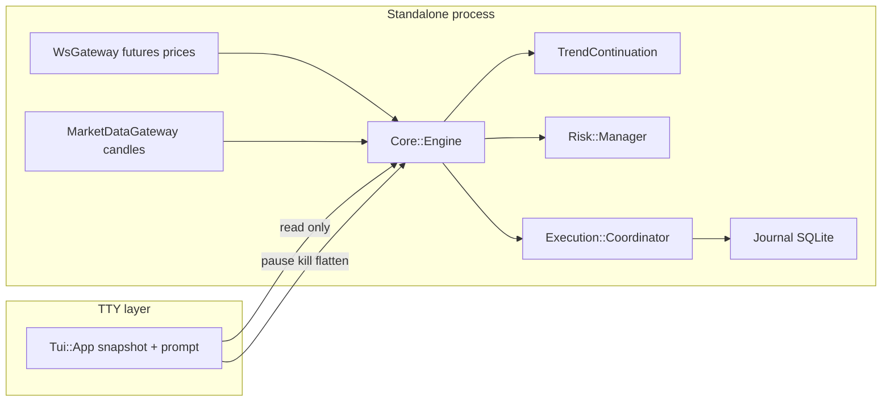

---
todos:
  - id: "deps-config"
    content: "Add sqlite3 to Gemfile; .gitignore bot.yml + journal DB; README setup from bot.yml.example"
    status: pending
  - id: "risk-leverage"
    content: "Align per_trade_inr min/max in Risk::Manager; enforce max_leverage on order path"
    status: pending
  - id: "strategy-filters"
    content: "Optional volume / structure / ADX-style gates in Indicators + TrendContinuation + specs"
    status: pending
  - id: "execution-partial"
    content: "Document partial limitation; spike exchange reduce/close if API payload is confirmed"
    status: pending
  - id: "tui-ux"
    content: "Non-blocking or clearer refresh UX (tty-reader or spinners); optional tty-logger for TUI mode"
    status: pending
  - id: "rails-doc"
    content: "README: Rails host pattern (adapter + long-lived engine + journal boundary)"
    status: pending
isProject: false
---
# CoinDCX futures bot — completion and Rails-ready hardening

## Current state (verified in-repo)

- **Entrypoint**: [`bin/bot`](bin/bot) → [`CoindcxBot::CLI`](lib/coindcx_bot/cli.rb) (`run`, `tui`, `doctor`).
- **Core loop**: [`CoindcxBot::Core::Engine`](lib/coindcx_bot/core/engine.rb) — WS futures price stream per configured pair (`CoinDCX::WS::PublicChannels.futures_price_stats`), periodic REST candles via [`Gateways::MarketDataGateway#list_candlesticks`](lib/coindcx_bot/gateways/market_data_gateway.rb), [`Strategy::TrendContinuation`](lib/coindcx_bot/strategy/trend_continuation.rb), [`Execution::Coordinator`](lib/coindcx_bot/execution/coordinator.rb), [`Persistence::Journal`](lib/coindcx_bot/persistence/journal.rb) (SQLite).
- **TUI**: [`Tui::App`](lib/coindcx_bot/tui/app.rb) uses `tty-prompt`, `tty-table`, `tty-box`, `tty-screen`, `pastel` — commands map to engine APIs only (pause / kill / flatten / quit).
- **Config template**: [`config/bot.yml.example`](config/bot.yml.example) already targets **two pairs**, **₹50k capital note**, **15m / 1h** resolutions, INR risk framing, and `dry_run: true`.
- **Instrument naming**: CoinDCX uses codes like `B-SOL_USDT` in the example; your `SOLUSDT.P`-style names are **exchange UI labels** — [`Doctor`](lib/coindcx_bot/doctor.rb) exists to print the exact `pair` strings to paste into `bot.yml`.

## Gaps to close (concrete)

1. **Runtime dependency**: [`Persistence::Journal`](lib/coindcx_bot/persistence/journal.rb) requires `sqlite3`, but [`Gemfile`](Gemfile) does not declare it — add `sqlite3` (and lock) so `bundle exec` works on a clean machine.
2. **Committed config path**: Only [`config/bot.yml.example`](config/bot.yml.example) exists; `Config.load` expects `config/bot.yml`. Keep `bot.yml` out of git (secrets not there, but local paths matter) — add `.gitignore` for `config/bot.yml` and `data/*.sqlite3`, and expand [`README.md`](README.md) with copy/setup steps (already referenced by CLI error text).
3. **Risk config parity**: `bot.yml.example` defines `per_trade_inr_min` but [`Risk::Manager#size_quantity`](lib/coindcx_bot/risk/manager.rb) only uses `per_trade_inr_max` — either wire min/max semantics (e.g. clamp) or drop the unused key from YAML.
4. **Leverage guard**: [`ExposureGuard#leverage_allowed?`](lib/coindcx_bot/risk/exposure_guard.rb) is unused — enforce when building orders (merge into `order_defaults` / validate before `create`) so `max_leverage` is not a dead setting.
5. **Strategy vs your spec**: Current logic has **HTF/LTF EMA alignment**, **ATR-based “trend strength” ratio**, **compression + breakout** and **pullback-to-EMA** entries, **1R partial (journal-only)**, **ATR/swing trailing**, **trend-failure exit**. Missing relative to your write-up: explicit **volume expansion**, **HH/HL (or LL/LH) structure**, and **ADX-like** filter — add small, testable building blocks in [`Indicators`](lib/coindcx_bot/strategy/indicators.rb) and gate in `TrendContinuation` behind new optional keys in `strategy:` (defaults preserve current behavior).
6. **Execution honesty**: [`Coordinator#handle_partial`](lib/coindcx_bot/execution/coordinator.rb) explicitly does **not** reduce on the exchange — document as limitation and, if CoinDCX futures API supports it, add a second phase: place reduce-only / close partial via `futures.orders` (confirm exact payload against [CoinDCX derivatives docs](https://docs.coindcx.com/) and gem models) so “1R partial” matches real exposure.
7. **Private WS for order/position sync** (optional slice): Subscribe to `CoinDCX::WS::PrivateChannels::ORDER_UPDATE_EVENT` in [`WsGateway`](lib/coindcx_bot/gateways/ws_gateway.rb) and feed reconciler logic so journal and exchange do not drift — start with logging + journal `event_log` before mutating state.
8. **TUI UX**: [`Tui::App`](lib/coindcx_bot/tui/app.rb) blocks on `prompt.select` between refreshes. Options: (a) use `tty-reader` for non-blocking keypress + periodic `print_screen`, or (b) document “refresh-driven” operation and add `tty-spinner` / `tty-progressbar` during `doctor` and engine startup — keep **no strategy logic** in TUI.
9. **Tests**: Extend specs for new indicator gates and for order payload guard (leverage); keep existing [`spec/coindcx_bot/*`](spec/) style (`minimal_bot_config` in `spec_helper`).
10. **Rails embedding doc** (no Rails app in this repo unless you ask): Add a short section to README — initializer configures `CoinDCX`, app defines `Brokers::Coindcx::*` adapter that **delegates to the same** `CoindcxBot::Gateways::*` classes, runs `CoindcxBot::Core::Engine` in a **dedicated thread or job process** (not per-request), journal path on disk or later swapped for ActiveRecord-backed `Journal` implementing the same methods — mirrors the gem’s [`docs/rails_integration.md`](https://raw.githubusercontent.com/shubhamtaywade82/coindcx-client/main/docs/rails_integration.md) “adapter layer” rule.

## Non-goals (unless you expand scope)

- Moving execution into Rails controllers or ActiveRecord models.
- Broad refactors or renaming `CoindcxBot` (large churn for little gain).
- Cross-broker abstractions (workspace rule: keep CoinDCX isolated).

## Verification

- `bundle exec rspec`
- `bundle exec ruby bin/bot doctor` (with env keys) to confirm SOL/ETH pair strings
- Manual: `bin/bot run` and `bin/bot tui` with `dry_run: true`, then paper/small-size live only after you validate order payload with your account