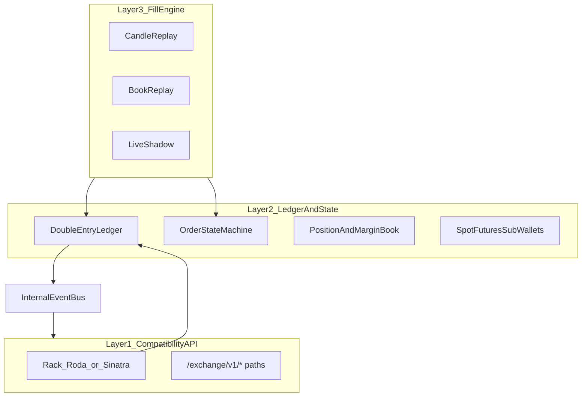

<!-- 3fc62aa7-2eb7-4ac0-98f4-2e6ba6fd45bd -->
---
todos:
  - id: "rack-skeleton-auth"
    content: "Add PaperExchange Rack app (Roda/Sinatra), route map for MVP futures wallet + health; verify CoinDCX HMAC using coindcx-client Signer or shared verifier; bin/paper-exchange entrypoint"
    status: pending
  - id: "ledger-schema"
    content: "Design SQLite schema: ledger_entries, accounts, holds, orders, fills, positions, api_keys; migrations + RSpec for double-entry invariants and atomic batches"
    status: pending
  - id: "wallet-services"
    content: "Implement futures wallet read + transfer with CoinDCX-shaped JSON; derived fields balance/locked/cross_order_margin/cross_user_margin from ledger"
    status: pending
  - id: "order-position-services"
    content: "Order state machine, market rules validation, 25-order cap, client_order_id uniqueness; position book from fills; margin modes"
    status: pending
  - id: "fill-engine-refactor"
    content: "Extract FillEngine into PaperExchange::FillStrategies (candle/book/live); single tick API feeding order matcher"
    status: pending
  - id: "bot-integration-flag"
    content: "Config flag to point CoinDCX::Client api_base_url at simulator and route Coordinator through OrderGateway/AccountGateway in paper mode; deprecate direct PaperBroker once parity proven"
    status: pending
  - id: "ws-phase5"
    content: "Spike Socket.IO private transport (Ruby vs Node sidecar); map internal events to CoinDCX private event shapes"
    status: pending
isProject: false
---
# CoinDCX-compatible paper exchange (Ruby, this repo)

## Current baseline

- **Execution today:** [`lib/coindcx_bot/execution/paper_broker.rb`](lib/coindcx_bot/execution/paper_broker.rb) + [`Persistence::PaperStore`](lib/coindcx_bot/persistence/paper_store.rb) (SQLite: `paper_orders`, `paper_fills`, positions) and [`FillEngine`](lib/coindcx_bot/execution/fill_engine.rb). Orders/positions are **not** CoinDCX REST/WS shaped; [`Coordinator`](lib/coindcx_bot/execution/coordinator.rb) branches: live uses `OrderGateway` + `coindcx-client`, paper calls `PaperBroker` with a Ruby hash.
- **Client hook:** [`coindcx-client` `Configuration`](../coindcx-client/lib/coindcx/configuration.rb) exposes `api_base_url`, `public_base_url`, `socket_base_url`. Private calls use [`HttpClient#authenticated_body` → `Auth::Signer`](../coindcx-client/lib/coindcx/transport/http_client.rb). A real compatibility server **must verify the same HMAC contract** (reuse or mirror `CoinDCX::Auth::Signer` verification in the simulator).
- **Roadmap doc:** [`docs/paper_broker_simulation.md`](docs/paper_broker_simulation.md) tracks tick-driven fills and journal sync—this plan **supersedes direction** for long-term shape (API + ledger) while Phases C–G there can still close short-term gaps if needed.

## Target architecture (three hard layers)

1. **Compatibility API** — Rack app mounting CoinDCX-documented paths; thin controllers map to application services; JSON bodies match exchange shapes (capture **golden fixtures** from real responses or client specs under `spec/fixtures/paper_exchange/`).
2. **Ledger + state engine** — new persistence (recommend **separate SQLite file** e.g. `data/paper_exchange.db` or new tables with a clear migration path) with append-only `ledger_entries`, explicit `holds` / reserved margin, and **recomputed snapshots** (`balance`, `locked_balance`, `cross_order_margin`, `cross_user_margin`, position fields, etc.)—not mutable floats as the sole truth.
3. **Market replay / fill engine** — refactor concepts from [`FillEngine`](lib/coindcx_bot/execution/fill_engine.rb) into strategy objects invoked by a **simulation clock** (tick from candles, from synthetic book snapshots, or from live LTP/book feed). Same invariants: fills only through this layer.

## Bounded contexts (explicit modules)

Introduce a dedicated namespace, e.g. `CoindcxBot::PaperExchange::` (or future extractable gem), with clear boundaries:

| Context | Responsibility |
|--------|------------------|
| `Wallets` | Spot, futures, optional sub-account spot; transfers (`/wallets/transfer`, `/wallets/sub_account_transfer`, futures wallet + transfer endpoints). |
| `Orders` | Lifecycle, client order id uniqueness, 25 open orders/market, idempotency headers, trigger orders. |
| `Positions` | Per-pair position, leverage, margin mode (cross vs isolated), add/remove margin, liquidation fields, TPSL linkage. |
| `Markets` | `markets_details`-driven validation (min/max qty, precision, allowed order types, status). |
| `Compat` | Request auth, rate limits, response normalization, errors matching client expectations. |

## REST surface (MVP aligned with your list)

Implement **handlers first**, then expand:

- **Futures (priority for this bot):** wallet list/details + transfer, positions list, leverage update, add/remove margin, cancel-all variants, exit, create TPSL, orders create/cancel/list/status as exposed by `coindcx-client` futures modules.
- **Spot (second):** create/cancel/list orders, wallet info, transfer—needed for full “transfer correctness” story.
- **Public market:** either **proxy** to real `public_base_url` for candles/trades/orderbook, or serve from recorded snapshots; simulator focuses on **private** state + fill decisions.

## WebSocket / Socket.IO (Phase 5 risk)

CoinDCX uses **Socket.IO (EIO3)**. Ruby has no first-class equivalent to `socket.io` as ubiquitous as in Node. **Pragmatic sequence:**

- **Phase 1–4:** REST-only private API + optional **polling** from the bot; internal `EventBus` ([`lib/coindcx_bot/core/event_bus.rb`](lib/coindcx_bot/core/event_bus.rb)) fans out events for future WS.
- **Phase 5:** Either (a) small **Node EIO3** sidecar that forwards to Ruby via Redis/HTTP, or (b) evaluate a maintained Ruby Socket.IO server if protocol match is verified—document the choice before building.

Public market WS can remain **real CoinDCX** (`socket_base_url` unchanged) while private streams come from the simulator later.

## Rate limits and caps

- Enforce **25 open orders per market** and **client_order_id** uniqueness in the order service (ledger-backed index).
- Implement a **token bucket** per API key (or global) matching documented **16/s and 960/min** at the Rack middleware layer; align with client-side [`endpoint_rate_limits`](../coindcx-client/lib/coindcx/configuration.rb) so tests do not flap.

## Bot integration (unchanged trading code at the HTTP boundary)

**End state:** With `runtime.paper: true` and e.g. `paper_exchange.url: http://127.0.0.1:9292`, the bot’s `CoinDCX::Client` uses `api_base_url` → simulator; **`OrderGateway` / `AccountGateway`** become the paper execution path instead of direct `PaperBroker` calls.

- **Migration strategy:** Keep `PaperBroker` until parity for futures order + position + wallet paths used by [`Coordinator`](lib/coindcx_bot/execution/coordinator.rb) and [`LiveBroker`](lib/coindcx_bot/execution/live_broker.rb); add a feature flag `paper_exchange.enabled` to switch coordinator to gateways-only paper mode; remove duplicate state paths once journal reconciliation is proven.
- **Process model:** Run `bin/paper-exchange` (or `rackup`) as a **long-lived daemon** beside `bin/bot`; avoids coupling HTTP server lifecycle to the strategy loop.

## Data model (essential tables)

- **Ledger:** `accounts` (chart of accounts per user/wallet/margin bucket), `ledger_entries` (double-entry lines), `journal_batches` (atomic commits), optional `external_ref` for idempotency keys.
- **Trading:** `orders`, `order_events`, `fills`, `positions`, `position_margin_events`, `instruments` / `market_rules` (cached from `markets_details`).
- **Identity:** `simulation_users`, `api_keys` (store key → user mapping for auth verification).
- **Session / replay:** `simulation_sessions`, `market_snapshots` (book-replay mode).

Denormalized snapshot tables or materialized views are optional optimizations after correctness.

## Order state machine and events

Canonical internal events (persist + publish): `order.accepted`, `order.reserved`, `order.partially_filled`, `order.filled`, `order.cancelled`, `order.rejected`, `order.triggered`, `position.opened|updated|closed`, `wallet.balance_changed`, `transfer.completed`. Map these to **CoinDCX-shaped private WS payloads** when WS lands.

States: `init → open → partially_filled → filled`; cancellations and partial cancel; `rejected`; trigger path `open → triggered → …`. Futures stages (`standard`, `exit`, `liquidate`, `tpsl_exit`) modeled explicitly where the API exposes them.

## Fill engine modes

1. **Candle replay** — extend current [`FillEngine#evaluate`](lib/coindcx_bot/execution/fill_engine.rb) rules; drive from OHLC passed into the simulator tick API or clocked from REST candles.
2. **Book replay** — consume snapshot-style depth (max 50 orders per update per your note); match limits/stops against replayed book.
3. **Live shadow** — same matching logic, prices from live public feed; **no** orders sent to real API.

## Testing and verification

- **RSpec:** unit tests for ledger invariants (no negative balances except explicit liquidation debt), order cap, idempotency; integration tests hitting Rack app with **real `Auth::Signer`-signed** requests (using test API secret).
- **Contract tests:** compare JSON keys/types to fixtures derived from CoinDCX docs + captured samples.
- **Do not** add a parallel Node module unless you explicitly want a split stack; this plan keeps **one Ruby codebase** and optional Node **only** for Socket.IO if Ruby path fails.

## Risks and unknowns

- **Response parity:** undocumented fields or drift vs production—mitigate with fixtures + periodic diff against live read-only calls.
- **Socket.IO private channel parity:** highest integration risk; defer after REST correctness.
- **Scope:** sub-account spot and full spot order book may be **Phase 2+** after futures vertical slice.

## Suggested implementation order (maps to your Phases 1–5)

1. **Ledger + futures wallet + transfers + REST auth** — Rack skeleton, signer verification, wallet endpoints, balance fields including `cross_order_margin` / `cross_user_margin`.
2. **Order state machine + reservation + caps + validation** — `markets_details` cache, min qty = max(min_quantity, precision floor).
3. **Positions** — open/update/close from fills only, leverage, margin mode, add/remove margin, basic liquidation rule (configurable).
4. **Fill modes** — plug candle/book/live into one tick entrypoint; engine calls into order/position services.
5. **Private events + rate limit hardening + WS transport** — emit from event bus; add reconciliation CLI or endpoint.
