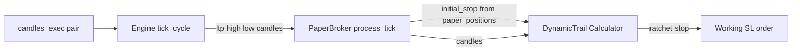

<!-- 27442f58-d49a-45c1-8eac-d5324a37b543 -->
---
todos:
  - id: "schema-initial-stop"
    content: "Add initial_stop_price to Journal + PaperStore migrations; set on open; never update on trail; extend insert_position / journal_open / place_bracket_order"
    status: pending
  - id: "require-dynamic-trail"
    content: "require dynamic_trail in coindcx_bot.rb"
    status: pending
  - id: "trend-continuation-wire"
    content: "Replace compute_trail_* with DynamicTrail::Calculator in trend_continuation.rb"
    status: pending
  - id: "paper-broker-engine"
    content: "PaperBroker: trail_config, candles on process_tick, DynamicTrail + legacy fallback; Engine: pass candles + trail_config; Broker + GatewayPaperBroker kwargs"
    status: pending
  - id: "specs"
    content: "Add dynamic_trail_spec.rb; update paper_broker_trailing_spec + any journal/coordinator specs; full rspec"
    status: pending
isProject: false
---
# Dynamic trailing integration and PnL / TP alignment

## Reality check on requirements

- **“Always close in +ve PnL”** cannot be guaranteed: the opening stop can still be hit (gap, trend failure, fees). What the bot *can* do is **ratchet the stop**, apply a **post-1R break-even gate** (already in [`lib/coindcx_bot/strategy/dynamic_trail.rb`](lib/coindcx_bot/strategy/dynamic_trail.rb)), and avoid **market exits that crystallize a small green print that fees erase** (separate, fee-aware rule — not in code today).
- **“30% instant exit”** in this repo is **not** `TrendContinuation`: bracket TP is **`take_profit_r_multiple` (default 3R)** in [`lib/coindcx_bot/execution/coordinator.rb`](lib/coindcx_bot/execution/coordinator.rb) (`compute_take_profit`). If the intent is “do not cap winners at a fixed TP while HTF trend still agrees,” the lever is **TP policy** (omit or widen TP), not only the trail calculator.
- **Continuation-friendly trailing** is largely what `DynamicTrail` already does: **velocity_factor** loosens the trail when price keeps moving in your direction; **vol_factor** widens when ATR expands.

## Critical fix: stable R for tiers

`positions.stop_price` is **updated on every trail** ([`journal.rb` `update_position_stop`](lib/coindcx_bot/persistence/journal.rb), [`coordinator.rb` trail handler](lib/coindcx_bot/execution/coordinator.rb)). If `initial_stop` for `DynamicTrail::Input` is taken from `stop_price` after the first ratchet, **profit/R tiers collapse** (risk distance shrinks).

**Add a frozen column** (both journal and paper sim):

| Store | Column | Set when | Updated on trail? |
|-------|--------|----------|-------------------|
| `positions` | `initial_stop_price` | `insert_position` | **No** |
| `paper_positions` | `initial_stop_price` | bracket / first SL attach | **No** |

- **Journal**: extend `migrate` (or a small post-`CREATE TABLE` migration) with `ALTER TABLE ... ADD COLUMN initial_stop_price TEXT`; in `insert_position`, set `initial_stop_price` = opening `stop_price`. Reads: `initial_stop = row[:initial_stop_price] || row[:stop_price]` for old rows.
- **PaperStore**: `add_column_if_missing('paper_positions', 'initial_stop_price', 'TEXT')`; set in [`place_bracket_order`](lib/coindcx_bot/execution/paper_broker.rb) when SL is first written (same value as opening SL).
- **DynamicTrail inputs**: `initial_stop` from `initial_stop_price` (fallback `stop_price`).

## Wiring (matches prior approved design, with fixes above)

1. **Load the calculator** — add `require_relative 'coindcx_bot/strategy/dynamic_trail'` in [`lib/coindcx_bot.rb`](lib/coindcx_bot.rb) (after `indicators`).

2. **`TrendContinuation`** ([`lib/coindcx_bot/strategy/trend_continuation.rb`](lib/coindcx_bot/strategy/trend_continuation.rb)):
   - `require_relative 'dynamic_trail'` (or rely on main loader).
   - Lazy `DynamicTrail::Calculator.new(@cfg)`.
   - In `manage_open`, replace `compute_trail_long` / `compute_trail_short` with `Calculator#call(DynamicTrail::Input.new(...))` using `initial_stop` from position hash, `current_stop` = `stop_price`, `ltp` = `price`, `candles` = `exec`.
   - On `output.changed`, emit `:trail` with `metadata` including `tier`, `v_factor`, `vol_factor` (optional, for logs).
   - Remove private `compute_trail_*`.

3. **`PaperBroker`** ([`lib/coindcx_bot/execution/paper_broker.rb`](lib/coindcx_bot/execution/paper_broker.rb)):
   - `initialize(..., trail_config: nil)`, `@trail_config = trail_config || {}`, memoized `trail_calculator`.
   - `process_tick(..., candles: nil)`; pass `candles` into `trail_working_stops`.
   - `compute_auto_trail`: if `candles` present and `size >= 16` (or match calculator’s ATR need), call `DynamicTrail` with **`initial_stop` from `pos[:initial_stop_price] || pos[:stop_price]`** and **`current_stop` from working SL**; else delegate to **`legacy_auto_trail`** (current 50%-of-profit body, unchanged).
   - Enrich log line with tier / factors when changed.

4. **`Engine`** ([`lib/coindcx_bot/core/engine.rb`](lib/coindcx_bot/core/engine.rb)):
   - `run_paper_process_tick`: pass `candles: @candles_exec[pair]`.
   - `build_broker` (in-process path): `trail_config: config.raw[:strategy] || {}` (or whatever accessor exists on `Config` for the strategy slice — use the same hash `TrendContinuation` uses).

5. **Broker base + gateway** — Ruby kwargs are strict:
   - [`Broker#process_tick`](lib/coindcx_bot/execution/broker.rb): add `candles: nil`.
   - [`GatewayPaperBroker#process_tick`](lib/coindcx_bot/execution/gateway_paper_broker.rb): add `candles: nil` and **ignore** (remote tick has no candle array today). Trailing on gateway paper stays **legacy server-side** unless the paper exchange API is extended later.

6. **`Coordinator`** ([`lib/coindcx_bot/execution/coordinator.rb`](lib/coindcx_bot/execution/coordinator.rb)):
   - `journal_open`: pass `initial_stop_price: signal.stop_price` into `insert_position` (extend method signature).

## Config and docs

- [`config/bot.yml`](config/bot.yml): optional commented keys under `strategy:` for trail overrides (as in the saved plan).
- **TP vs trail**: document that **`paper.take_profit_r_multiple`** sets fixed TP distance; for “trail primary,” either set a **very large** multiple or add a small follow-up to support **`take_profit_r_multiple: null`** / `take_profit: false` so `compute_take_profit` returns `nil` (bracket without TP). Not required for the trail integration slice but directly answers “don’t instant-exit at X while trend continues.”

## Tests

- **New** [`spec/coindcx_bot/strategy/dynamic_trail_spec.rb`](spec/coindcx_bot/strategy/dynamic_trail_spec.rb) — behaviors listed in the prior plan (tiers, velocity, vol, ratchet, break-even gate, short symmetry, config override, floor, insufficient bars).
- **Update** [`spec/coindcx_bot/execution/paper_broker_trailing_spec.rb`](spec/coindcx_bot/execution/paper_broker_trailing_spec.rb): pass synthetic `candles` (or assert new dynamic behavior with a candle factory); keep one example with `candles: nil` proving **legacy** trail still works.
- **Journal / PaperStore**: examples or lightweight specs that after trail, `initial_stop_price` is unchanged and `DynamicTrail` tier uses original R.
- Run `bundle exec rspec`.

## Ambiguous user phrase (`min(fees, 1000)` / `max(30%, 100%)`)

Treat as **out of scope** for this slice until clarified: it could mean fee-aware minimum profit, partial scale-out bands, or INR/USDT clamps. After trail wiring, a short follow-up can map it to `Risk::Manager` / coordinator if you specify units (INR vs USDT vs % of margin).

## Mermaid — data flow (in-process paper)

