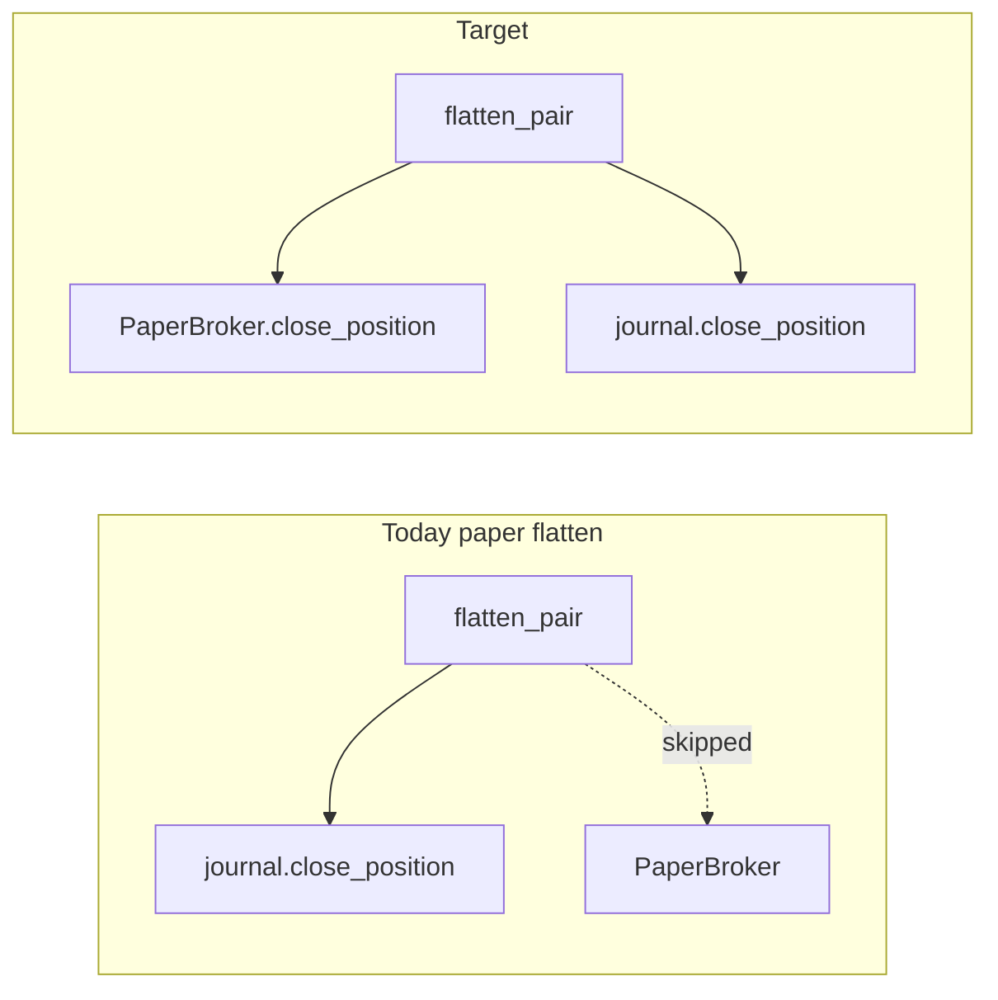

<!-- 1b2868db-f878-424d-b48b-b95f1bc4e230 -->
---
todos:
  - id: "slice-flatten-ltps"
    content: "Engine: build ltps (tracker + exec candle fallback); Coordinator#flatten_all(pairs, ltps:); paper flatten calls PaperBroker then journal; specs"
    status: pending
  - id: "slice-pnl-single-path"
    content: "Return or read paper realized USDT on close; Coordinator books INR once; remove duplicate record_paper_realized_pnl path; specs"
    status: pending
  - id: "readme-verify"
    content: "README + docs/new_improvements.md: update flatten/PnL bullets after code lands"
    status: pending
  - id: "optional-journal-entry"
    content: "(Optional) Sync journal entry_price to paper fill after entry open"
    status: pending
isProject: false
---
# Paper mode ledger and flatten consistency

## Problem

Today [`Coordinator#flatten_pair`](lib/coindcx_bot/execution/coordinator.rb) skips the broker when `broker.paper?` (line 23) but still removes journal rows. That leaves **open rows in `paper_positions`** while the strategy journal is flat. Separately, strategy-driven paper closes run **`PaperBroker#close_position`** (USDT PnL in SQLite) and **`Coordinator#record_paper_realized_pnl`** (INR in journal)—two formulas that can diverge from slipped fills.

## Design choices (defaults for this plan)

1. **LTP for paper flatten**: Built in **`Engine#flatten_all!`** only—no `PositionTracker` injected into `Coordinator`. Pass a `ltps` hash: `pair => BigDecimal` using `@tracker.ltp(pair)` first, then **`@candles_exec[pair]&.last&.close`** as fallback (same idea as `seed_tracker_from_last_candle_if_no_ltp` in [`engine.rb`](lib/coindcx_bot/core/engine.rb)). If still nil, **skip** `PaperBroker#close_position` for that pair, **log a warning**, and still close journal rows (documented degradation).

2. **Coordinator API**: Change to `flatten_all(pairs, ltps: {})` with default `ltps = {}` for backward compatibility; update [`Engine#flatten_all!`](lib/coindcx_bot/core/engine.rb) to compute and pass `ltps`.

3. **Single INR booking after paper exit**: Prefer **one** path: after a successful paper `close_position`, book INR from **paper-computed realized USDT** (fee-aware) × `config.inr_per_usdt`, instead of recomputing from journal entry × signal LTP. That implies **`PaperBroker#close_position`** returns a structured result (e.g. `Gateways::Result`-style or a small hash) including **realized PnL USDT** when closing, or the coordinator reads the closed row from `PaperStore` immediately after close—pick the smallest change that avoids double-counting; add a spec that **one close produces one `add_daily_pnl_inr` delta**.

## Implementation slices

### Slice 1 — Paper flatten closes `PaperStore`

- [`lib/coindcx_bot/core/engine.rb`](lib/coindcx_bot/core/engine.rb): `flatten_all!` builds `ltps` per configured pair (tracker → exec candle close fallback).
- [`lib/coindcx_bot/execution/coordinator.rb`](lib/coindcx_bot/execution/coordinator.rb): When `@broker.paper?`, before journal closes, if `PaperBroker` has an open position for that pair (via `open_position_for(pair)` or existing store API), call `@broker.close_position(...)` with resolved `ltp`, **full position quantity**, and `position_id` as needed. Then close matching journal rows (current loop). Remove or narrow the `unless @broker.paper?` guard on the generic `close_position` call—replace with explicit paper path so arguments match [`PaperBroker#close_position`](lib/coindcx_bot/execution/paper_broker.rb) (`side`, `quantity`, `ltp` from row + ltps map).
- [`spec/coindcx_bot/execution/coordinator_spec.rb`](spec/coindcx_bot/execution/coordinator_spec.rb): Example: journal + paper store both have an open position → `flatten_pair` with known `ltps` → paper position closed in store and journal row closed.

### Slice 2 — Unify INR PnL on strategy close (no double count)

- [`Coordinator#close_via_paper_broker`](lib/coindcx_bot/execution/coordinator.rb): Stop using `record_paper_realized_pnl` with journal entry × exit LTP when the broker already computed fill-based PnL; instead book INR from **broker/store realized USDT** for that close.
- May require extending [`PaperBroker#close_position`](lib/coindcx_bot/execution/paper_broker.rb) to return `realized_pnl` (USDT) or total fees for the closed leg.
- Spec: strategy close records **one** daily PnL movement consistent with `PaperStore` realized PnL for that trade.

### Slice 3 (optional follow-up) — Journal entry vs slipped fill

- After paper entry, update journal `entry_price` to the **fill price** from `PaperBroker` / last fill so risk and journal match simulation (may need a small `Journal` method). Lower priority than slices 1–2.

## Risks

| Risk | Mitigation |
|------|------------|
| Live path regression | Keep `broker.paper?` branches explicit; live `flatten_pair` behavior unchanged (still `close_position` with `ltp: 0` as today). |
| Nil LTP on flatten | Fallback chain + warn + skip paper close only if unavoidable; document in README. |
| Spec brittleness | Use in-memory or temp `PaperStore` paths already used in [`paper_broker_spec.rb`](spec/coindcx_bot/execution/paper_broker_spec.rb). |

## Verification

- `bundle exec rspec` for coordinator, paper_broker, journal as touched.
- Update [`README.md`](README.md) paper/flatten bullet if it still says flatten only closes journal rows.
- Manual: TUI `f` in `dry_run` with an open position—confirm `paper_positions` has no open row for that pair after flatten.

## Open questions (resolved above for planning)

If you prefer **injecting `PositionTracker` into `Coordinator`** instead of `ltps:` from the engine, say so before implementation—it is equivalent but couples coordinator to tick infrastructure.
