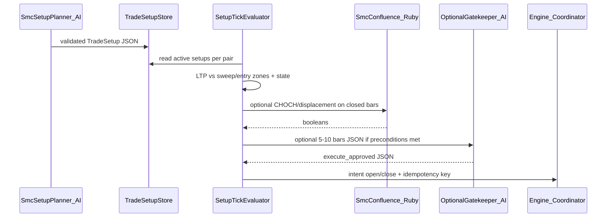

<!-- 4b57ce20-8b3c-4a4f-b359-9d98cca7527d -->
---
todos:
  - id: "schema-setup-vo"
    content: "Add TradeSetup JSON schema + SmcSetup::Validator + immutable value object + config keys"
    status: pending
  - id: "store-persist"
    content: "TradeSetupStore in-memory + SQLite persistence (journal or smc_setups) + reload on boot"
    status: pending
  - id: "state-evaluator"
    content: "State machine + TickEvaluator from Engine tick_cycle using LTP + @candles_exec confirmations"
    status: pending
  - id: "execution-bridge"
    content: "Map armed setup to Coordinator Signal; mutex + setup_id idempotency; respect risk/stale/max positions"
    status: pending
  - id: "planner-brain"
    content: "SmcSetup::PlannerBrain (Ollama JSON) async; optional GatekeeperBrain on closed bars"
    status: pending
  - id: "tests"
    content: "RSpec: validator, state transitions, evaluator edge cases, no double-fire"
    status: pending
isProject: false
---
# SMC AI TradeSetups + event-driven triggers (CoinDCX futures)

## Current reality in this repo

- **Regime AI** ([`lib/coindcx_bot/regime/ai_brain.rb`](lib/coindcx_bot/regime/ai_brain.rb)): Ollama `format: 'json'` returns **regime narrative** keys (`regime_label`, `probability_pct`, …). Wired in [`Engine#refresh_regime_ai_if_due`](lib/coindcx_bot/core/engine.rb) for **TUI only** — **no orders**.
- **HMM** feeds `regime_hint_for` → `regime_vol_tier` / TUI — not LLM-driven execution.
- **SMC-CE** ([`lib/coindcx_bot/smc_confluence/engine.rb`](lib/coindcx_bot/smc_confluence/engine.rb) + [`Strategy::SmcConfluence`](lib/coindcx_bot/strategy/smc_confluence.rb)): **fully deterministic** on REST candles; **no AI**.

Your target architecture (JSON setups, state machine, LTP triggers, optional LLM gatekeeper on OHLCV) is **new** relative to the above and should be a **separate concern** from `Regime::AiBrain` so regime TUI stays stable.

## Target architecture (CoinDCX USDT-M only)

**Hard rules (aligned with your TL;DR):**

- **Never** send raw tick streams to the LLM. Planner runs on **scheduled / manual / HTF candle boundary** with summarized OHLCV + zones. Gatekeeper (if enabled) runs only on **5–10 recent closed bars** JSON after deterministic preconditions.
- **Execution** uses **Ruby** for sweep/zone/CHOCH/displacement where possible; AI returns **booleans + structured analysis**, not markdown.
- **Instruments**: `B-ETH_USDT`, `B-SOL_USDT` style pairs; **no** options/strikes/Dhan.

## Step 1 — JSON schema + validation

- Add a **versioned schema** (e.g. JSON Schema file under `config/schemas/` or `lib/coindcx_bot/smc_setup/schema.json`) for `TradeSetup`:
  - `setup_id`, `pair`, `direction` (`long`|`short`), `leverage` (optional), `conditions` (`sweep_zone`, `entry_zone`, `confirmation_required` array), `execution` (`sl`, `targets[]`, risk fields compatible with existing sizing: e.g. reuse `stop_distance` or absolute `sl` price).
- Ruby validator: small class `SmcSetup::Validator` using `json_schemer` **if** you add the gem, or minimal required-key checks to avoid new deps initially.

## Step 2 — TradeSetup store (no Redis in v1)

- This repo has **no Redis**. **v1**: in-memory `TradeSetupStore` (hash keyed by `pair` → list of setups) + **persist** to SQLite via existing [`Persistence::Journal`](lib/coindcx_bot/persistence/journal.rb) **or** a new lightweight `smc_setups` table — so restarts reload active setups.
- **v2** (optional later): Redis `HSET` if you run multiple processes.

## Step 3 — State machine (explicit, per setup)

- Ruby **enum-like** states: `pending_sweep` → `sweep_seen` → `awaiting_confirmations` → `armed_entry` → `active` → `completed` / `invalidated`.
- Transitions driven by:
  - **LTP** from [`PositionTracker`](lib/coindcx_bot/position_tracker.rb) / tick path (already updated on WS).
  - **Closed-bar events** from execution (or 1m if you add a mini aggregator) for CHOCH/displacement — **reuse or extend** `SmcConfluence::BarResult` flags rather than parsing AI text.
- **Hysteresis / debounce**: require sweep zone hit for **N ms** or **re-entry after leave** to avoid boundary chatter; document in code.

## Step 4 — Tick/candle evaluator (hot path)

- New service, e.g. `SmcSetup::TickEvaluator`, called from **`Engine#tick_cycle`** after LTP is known (same thread as strategy — avoids WS race) **or** from a dedicated hook with **mutex** if touching shared state from WS thread.
- For each active setup on the pair:
  - Compare `ltp` to `sweep_zone` / `entry_zone`.
  - When `confirmation_required` includes `choch_down` / `displacement`, set flags from **last closed** exec candle series (already loaded in `@candles_exec`).
- **Optional gatekeeper**: if `gatekeeper: true` on setup, enqueue Ollama call **only** when deterministic preconditions are satisfied; response JSON `{ "execute_trade": bool, "analysis": { ... } }`; timeout + fail-closed (`execute_trade: false`).

## Step 5 — Execution bridge (Coordinator)

- **Do not** bypass [`Execution::Coordinator`](lib/coindcx_bot/execution/coordinator.rb): map armed setup → `Signal` (`open_long`/`open_short`) with `stop_price` from setup `sl` or distance from entry.
- **Idempotency**: in-process **mutex per `setup_id`** + journal flag `setup_id` on open position row (extend journal schema minimally) so the same setup cannot double-fire across ticks.
- Respect existing **risk** (`Risk::Manager`), **stale WS**, **max positions**, **dry_run**.

## Step 6 — AI prompts (two roles)

1. **Planner (async, low frequency)**  
   - Input: HTF + exec OHLCV summaries, key levels, pair, current positions count.  
   - Output: **single JSON** matching TradeSetup schema (no markdown).  
   - New class e.g. `SmcSetup::PlannerBrain` (mirror `AiBrain` pattern: `format: 'json'`, `parse_json_object`, temperature low).

2. **Gatekeeper (optional, on trigger)**  
   - Input: setup slice + **last 5–10 closed bars** JSON + sweep already detected flag.  
   - Output: small JSON with `execute_trade` + reasons.

## Step 7 — Config + safety

- `bot.yml`: `smc_setup:` block — `enabled`, `planner_interval_seconds`, `gatekeeper_enabled`, `max_active_setups_per_pair`, paths to schema.
- Default **off**; when on, **paper/dry_run** first.

## What we explicitly do **not** do in v1

- DhanHQ / NSE / CE-PE / `securityId` (wrong domain for this repo per workspace boundaries).
- Feeding WebSocket ticks to the LLM.
- Replacing `Regime::AiBrain` regime JSON with trade setups (keep separate).

## Risks

- **Slippage**: MARKET on sweep bars; consider limit-in-zone after `armed_entry` (config flag).
- **Latency**: Gatekeeper adds 0.5–3s; default **off** for latency-sensitive runs.
- **CHOCH from AI vs Ruby**: prefer Ruby `SmcConfluence` for parity; AI only as override gate.

## Implementation order (suggested slices)

1. Schema + `TradeSetup` value object + Validator + in-memory store + journal persistence.
2. State machine + `TickEvaluator` hooked from `Engine#tick_cycle` (dry_run only) + logging.
3. Coordinator bridge + mutex + journal `setup_id`.
4. `PlannerBrain` + config + manual/scheduled invocation (reuse Ollama client pattern from `AiBrain`).
5. Optional gatekeeper + debounce tuning + tests.
