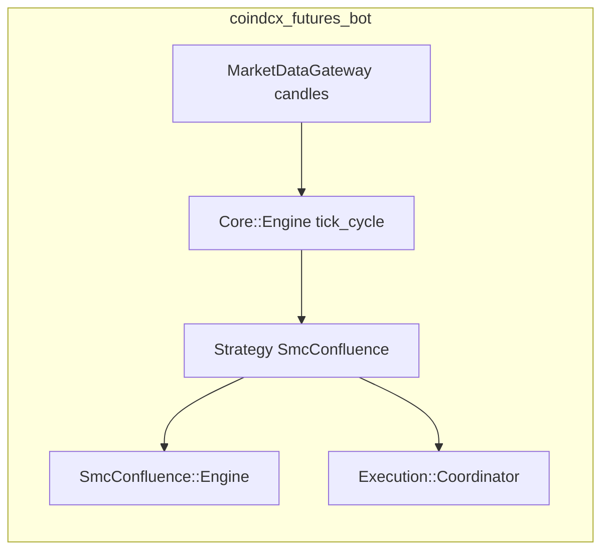

<!-- 4b57ce20-8b3c-4a4f-b359-9d98cca7527d -->
---
todos:
  - id: "port-smc-module"
    content: "Copy SmcConfluence Configuration/State/BarResult/Engine into coindcx_futures_bot; fix Time.zone; namespace CoindcxBot::SmcConfluence"
    status: pending
  - id: "candle-adapter"
    content: "Add Dto::Candle -> engine hash adapter; document volume optional for VP layer"
    status: pending
  - id: "strategy-smc"
    content: "Implement Strategy::SmcConfluence (evaluate -> Signal); wire build_strategy + bot.yml keys"
    status: pending
  - id: "relaxed-presets"
    content: "Document/example relaxed min_score, sig_cooldown, swing, ob/liq/session tolerances in bot.yml.example"
    status: pending
  - id: "specs"
    content: "Port engine_spec + add strategy smoke spec with synthetic CHOCH+confluence path"
    status: pending
isProject: false
---
# SMC-CE (delta_exchange_bot) and CoinDCX futures bot integration

## What “SMC-CE” is

In `delta_exchange_bot`, **SMC-CE** is **`Trading::Analysis::SmcConfluence::Engine`** (`backend/app/services/trading/analysis/smc_confluence/engine.rb`), described in-repo as Pine parity with `pinescripts/smc_confluence.pine`. It is **not** Delta-API-specific: it only needs an array of candles as hashes with `:open`, `:high`, `:low`, `:close`, `:timestamp` (optional `:volume` for volume-profile layers).

Multi-timeframe packaging lives in `SmcConfluenceMtf` (`smc_confluence_mtf.rb`), which runs the engine per resolution and builds alignment maps for dashboards/alerts.

**Separate** from CE: `SmcEntryContext` (`smc_entry_context.rb`) is a small **flag helper** over serialized snapshots (OB/FVG/liquidity edges)—useful for UI or extra gates, not required to reproduce CE signals.

## Why official signals are infrequent

From `Engine#step_bar` (lines 209–227):

- **`long_signal`** requires **`choch_bull`** on that bar (`long_s1 == 1`), **and** `long_score >= min_score`, **and** bar cooldown since last signal.
- **`long_score`** is the sum of six 0/1 terms: CHOCH, inside bull OB, recent bull sweep, VP confluence, session-level confluence, bear TL retest (mirror for short).

So **CHOCH is mandatory** for `long_signal` / `short_signal`; you cannot get a “CE signal” without a bullish/bearish CHOCH on that close. Then you need enough **other** confluence (default **`min_score: 3`** means CHOCH + **at least two** other factors, since CHOCH already counts as 1). **`sig_cooldown: 5`** (bars) suppresses repeats.

`SmcConfluence::Configuration` defaults (`configuration.rb`): `min_score: 3`, `sig_cooldown: 5`, `ob_body_pct: 0.3`, `ob_expire: 50`, `liq_wick_pct: 0.1`, `poc_zone_pct: 0.2`, `sess_liq_pct: 0.1`, `tl_retest_pct: 0.15`, pivots from ENV (`ANALYSIS_SMC_SWING`, etc., default swing length 10).

## “More relaxed” tuning (no code change) — if you run CE as-is

Applied via a custom `SmcConfluence::Configuration` instance (today in Delta: pass into `SmcConfluenceMtf.from_timeframe_candles` / job path; after port: pass from `bot.yml`):

| Parameter | Default | Relaxed direction | Effect |
|-----------|---------|-------------------|--------|
| `min_score` | 3 | **2** (or **1** very aggressive) | Fewer confluence pieces required once CHOCH exists |
| `sig_cooldown` | 5 | **1–2** | Allows signals on closer bars |
| `smc_swing` / `ms_swing` | 10 | **6–8** | More pivot confirmations → more CHOCH/BOS noise |
| `ob_body_pct` | 0.3 | **0.15–0.2** | Easier OB creation after structure break |
| `ob_expire` | 50 | **70–100** | OB zones valid longer → more `in_*_ob` |
| `liq_wick_pct` | 0.1 | **0.15–0.25** | More liquidity sweeps counted |
| `poc_zone_pct` / `sess_liq_pct` / `tl_retest_pct` | small % | **widen** | More VP / session / TL retest hits |

**Trade-off:** more signals usually means **more chop and false entries**; keep risk sizing and daily loss limits conservative when relaxing.

## Optional logic change (stronger frequency lift)

If you still want **more entries than “CHOCH + score” allows**, you must **change the signal rule** in a forked engine (e.g. allow **`bos_bull`** to substitute for `long_s1`, or require `long_score >= N` **without** mandating CHOCH). That diverges from Pine parity and should be a **named mode** (e.g. `signal_mode: choch_strict | bos_relaxed`) with tests.

## Using this in `coindcx_futures_bot` (current state)

Today this repo’s entries come from **`Strategy::SupertrendProfit`** / **`TrendContinuation`** (`lib/coindcx_bot/core/engine.rb` → `build_strategy`). There is **no** SMC stack here.

**Recommended integration path** (aligned with workspace “broker-agnostic math OK”):

1. **Port** the SmcConfluence stack into this repo under a neutral namespace, e.g. `lib/coindcx_bot/smc_confluence/`:
   - `configuration.rb`, `state.rb`, `bar_result.rb`, `engine.rb`
   - Replace the only Rails coupling in `engine.rb`: `Time.zone.at(ts)` → `Time.at(ts).utc` (or injectable clock for tests).
   - Re-namespace constants from `Trading::Analysis::SmcConfluence` to `CoindcxBot::SmcConfluence` (or similar).

2. **Adapter**: map `Dto::Candle` arrays to `Engine`-expected hashes (`timestamp` from candle time, volume if CoinDCX feed provides it; if volume is often nil, VP-based score terms stay 0—then lower `min_score` matters more).

3. **New strategy** (e.g. `Strategy::SmcConfluence` or `SmcConfluenceScalp`):
   - On each `evaluate`, run `Engine.run(exec_candles, configuration: cfg).last` (and optionally require HTF alignment by running a second series on HTF candles and AND/OR flags—configurable).
   - Map `last.long_signal` → `open_long` with stop from last swing/ATR (new YAML keys); `short_signal` → `open_short`; else `hold` with reason `smc_no_signal` / scores in metadata for TUI.
   - Register in `Engine#build_strategy` behind `strategy.name: smc_confluence` (or similar).

4. **`config/bot.yml`**: add a `smc_confluence:` (or nested under `strategy:`) block mirroring `Configuration` fields so “relaxed” presets are **data**, not ENV.

5. **Tests**: Port/adapt `backend/spec/services/trading/analysis/smc_confluence/engine_spec.rb` into this repo to lock behavior; add one integration spec that feeds synthetic candles and expects a signal when `min_score` is lowered.

## What not to do

- **Do not** couple CoinDCX order execution to Delta’s Rails stack or Redis; keep SMC as **local Ruby** on candles already fetched via CoinDCX.
- **Avoid** a hard dependency on `delta_exchange_bot` as a gem unless you extract SmcConfluence to a **tiny shared gem** first (cleaner long-term, more repo churn).

## Architecture sketch

