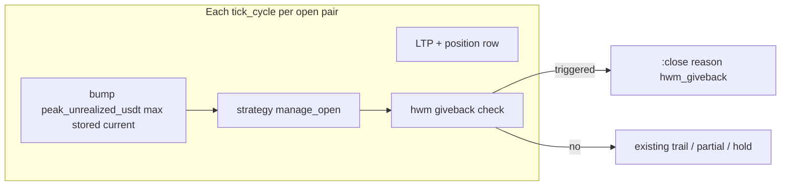

<!-- 651beb75-81b0-49cc-b026-f6feb5285b89 -->
---
todos:
  - id: "journal-peak-col"
    content: "Add positions.peak_unrealized_usdt + Journal#bump_peak_unrealized_usdt"
    status: pending
  - id: "unrealized-helper"
    content: "Extract shared unrealized USDT helper (match DeskViewModel long/short)"
    status: pending
  - id: "engine-bump"
    content: "Engine#process_pair: bump peak before strategy.evaluate when pos+ltp"
    status: pending
  - id: "hwm-module"
    content: "Strategy::HwmGiveback + YAML config; wire TrendContinuation + SupertrendProfit"
    status: pending
  - id: "rspec"
    content: "Specs: HwmGiveback, journal bump, one strategy integration"
    status: pending
isProject: false
---
# Peak unrealized (HWM) giveback exits

## Problem

- Today, open positions are managed with **price-based** logic: `Strategy::DynamicTrail` (ATR, R-multiples, velocity) in [`trend_continuation.rb`](lib/coindcx_bot/strategy/trend_continuation.rb) and [`paper_broker.rb`](lib/coindcx_bot/execution/paper_broker.rb) `trail_working_stops`.
- **Unrealized PnL in USDT** is computed for display ([`desk_view_model.rb`](lib/coindcx_bot/tui/desk_view_model.rb)) but **not persisted as a running maximum** per position.
- So a move like “+15 USDT then fade to +8 USDT” can happen **without** a trail or stop firing if the **price** path does not satisfy the existing trail math.

## Approach



1. **Persist MFE in USDT** on the journal row: new nullable column `peak_unrealized_usdt` on `positions` (TEXT/`BigDecimal` string), migrated like `initial_stop_price` in [`journal.rb`](lib/coindcx_bot/persistence/journal.rb) `migrate_positions_columns`.
2. **Monotonic bump in the engine** (single place, no strategy writing SQLite): in [`engine.rb`](lib/coindcx_bot/core/engine.rb) `process_pair`, when `position` and `ltp` exist, compute unrealized USDT with the **same formula** as the TUI (extract a small shared helper, e.g. `CoindcxBot::Strategy::UnrealizedPnl` or under `lib/coindcx_bot/dto/` / existing indicators—avoid duplicating long/short math in three places).
3. **Journal API**: `bump_peak_unrealized_usdt(id, current_usdt)` → `new_peak = max(stored_peak, current_usdt)` (treat missing stored as “no prior peak” using a sentinel so first negative ticks do not poison MFE; e.g. only update when `current > stored` if you want peak to mean “best unrealized seen”; the clean rule is `peak = max(stored || -Inf, current)` so once profit runs, peak rises with rallies and never drops when PnL falls).
4. **Pure policy module**, e.g. `Strategy::HwmGiveback` in `lib/coindcx_bot/strategy/hwm_giveback.rb`:
   - Inputs: `position` row (includes `peak_unrealized_usdt`), `ltp`, `strategy_config` subtree `hwm_giveback:`.
   - **Arm** only if `peak >= min_peak_usdt` (e.g. 10).
   - **Trigger** if drawdown from peak in USDT space exceeds rule, e.g. `(peak - current) / peak >= giveback_pct` when `peak > 0`, and/or optional `giveback_usdt` floor.
   - Output: `nil` or `Signal` `:close` with `reason: 'hwm_giveback'` and metadata `{ peak_usdt:, current_usdt:, drawdown_pct: }` for logs/TUI forensics.
5. **Call site order** inside `manage_open` / `manage_position`:
   - **TrendContinuation** ([`trend_continuation.rb`](lib/coindcx_bot/strategy/trend_continuation.rb)): after hard stop check, **before** 1R partial and `DynamicTrail`, call HWM; if signal, return it.
   - **SupertrendProfit** ([`supertrend_profit.rb`](lib/coindcx_bot/strategy/supertrend_profit.rb)): after `no_ltp` / entry checks, **before** `take_profit_pct` close, same HWM check so scalpers using this strategy get the same protection.

## Configuration (YAML)

Under `strategy:` (alongside existing `trail_*` keys), e.g.:

```yaml
strategy:
  hwm_giveback:
    enabled: true
    min_peak_usdt: 10      # only evaluate giveback after peak unrealized reached this
    giveback_pct: 0.35     # close if (peak - current) / peak >= 0.35 and peak >= min_peak
    # giveback_usdt: 5     # optional: also close if peak - current >= 5 USDT
```

`Config` can expose `strategy[:hwm_giveback]` as-is (already deep_symbolize’d) or small readers if you want defaults.

**Default**: `enabled: false` to preserve current behavior; optionally add to [`scalper_profile.rb`](lib/coindcx_bot/scalper_profile.rb) overlay (e.g. `enabled: true`, `min_peak_usdt: 10`) only for keys the user omits—same pattern as other scalper defaults.

## Testing

- **Unit**: `HwmGiveback` with table-driven examples (peak 15, current 8, pct 0.35 → trigger; peak 5 with min 10 → no trigger; negative current with peak 15 → trigger if pct met).
- **Journal**: migration adds column; `bump_peak_unrealized_usdt` monotonicity.
- **Integration**: one spec that stubs journal + strategy path or exercises `TrendContinuation#manage_open` with a fake position row including peak.

## Scope / non-goals (v1)

- **Primary exit**: `:close` on giveback (clear semantics, works for paper + coordinator + live close path).
- **Alternative (later)**: instead of close, emit a **tight trail** at a price that locks a fraction of peak USDT—needs inverting uPnD→price and interacts with broker SL; document as phase 2 if you want “never give back” as **stop-only** rather than flat.

## Risks

- **Flicker**: small giveback_pct on noisy LTP could churn; mitigate with `min_peak_usdt` and sane defaults (and optional `giveback_usdt` minimum).
- **Live vs paper**: USDT unrealized formula must stay **consistent** with how sizes/prices are stored in the journal (same as TUI); gateway paper uses same journal rows.
